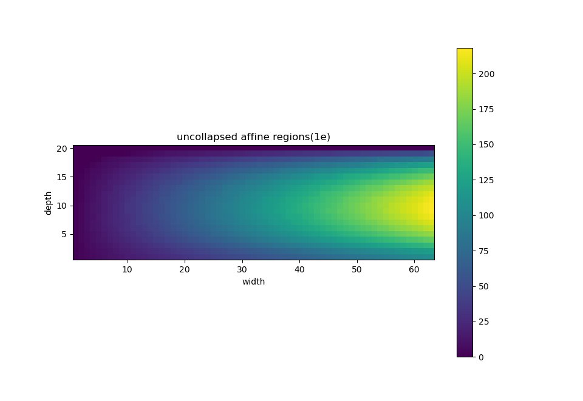

# affine_regions_upper_bound_computation
ReLU feed-forward neural network, histogram, affine regions, upper bound, implementation.

Based on:

[A Framework for the construction of upper bounds on the number of affine linear regions of ReLU feed-forward neural networks](https://arxiv.org/abs/1806.01918)

[Using activation histograms to bound the number of affine regions in ReLU feed-forward neural networks](https://arxiv.org/abs/2103.17174)

The total framework is proposed by paper 1.

Paper 2 proposed some tighter bounds over astivation histograms.

The solution to the recursive bound proposed in 3.2.5 in paper 2 is attained through observation, whose calculation process is in the ub method of ubc.

## prerequisite
python3

matplotlib

numpy

## todo
improve the bound

## example

The example demonstrates the uncollapsed affine regions for input dimension i, model structure i x ki x kki x ... bounded by the same parameter size.For example:

8 x 8 x 8 x 8 x 8 x 8 has depth 5, parameter size 8 x 8 x 5 = 320

for depth 4, calculate factor k = 1.0555 so that

8 x 8 x 9 x 9 x 10, parameter size = 307

for depth 3, k = 1.1725

8 x 9 x 11 x 13, parameter size = 314

...

depth 1 ==> 8 x 40 = 320

In the picture below, width means input dimension. Different widths correspond to different parameter sizes. Different depths correspond to different ks.

